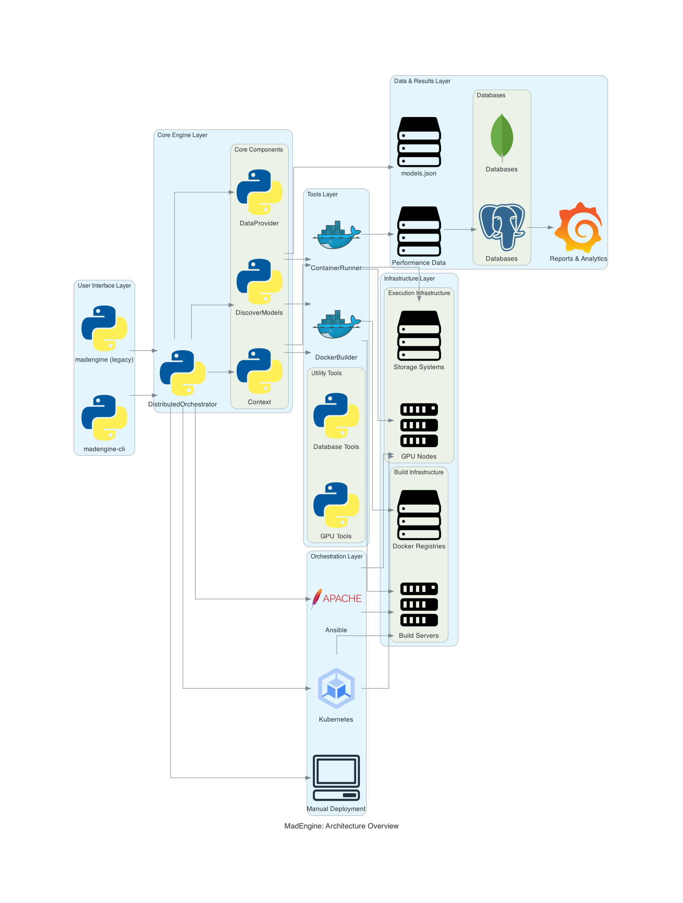
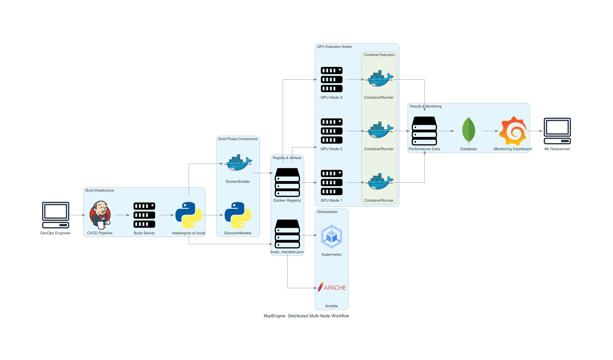

# madengine

[](https://python.org)
[](https://github.com/ROCm/madengine/actions)
[](https://github.com/psf/black)

> **Enterprise-grade AI model automation and distributed benchmarking platform**

madengine is a sophisticated CLI tool designed for running Large Language Models (LLMs) and Deep Learning models across local and distributed environments. Built with modern Python practices, it provides both traditional single-node execution and advanced distributed orchestration capabilities as part of the [MAD (Model Automation and Dashboarding)](https://github.com/ROCm/MAD) ecosystem.

## Table of Contents

- [🚀 Quick Start](#-quick-start)
- [✨ Features](#-features)
- [🏗️ Architecture](#️-architecture)  
- [📦 Installation](#-installation)
- [💻 Command Line Interface](#-command-line-interface)
- [🔍 Model Discovery](#-model-discovery)
- [🌐 Distributed Execution](#-distributed-execution)
- [⚙️ Configuration](#️-configuration)
- [🎯 Advanced Usage](#-advanced-usage)
- [🚀 Deployment Scenarios](#-deployment-scenarios)
- [📝 Best Practices](#-best-practices)
- [🔧 Troubleshooting](#-troubleshooting)
- [📚 API Reference](#-api-reference)
- [🤝 Contributing](#-contributing)
- [📄 License](#-license)

## 🚀 Quick Start

> **Important**: madengine must be executed from within a MAD package directory for proper model discovery.

### Prerequisites
- Python 3.8+ with pip
- Docker with GPU support (ROCm for AMD, CUDA for NVIDIA)
- Git for repository management
- [MAD package](https://github.com/ROCm/MAD) cloned locally

### Install madengine

```bash
# Basic installation
pip install git+https://github.com/ROCm/madengine.git

# With distributed runner support
pip install "madengine[runners] @ git+https://github.com/ROCm/madengine.git"

# Development installation
git clone https://github.com/ROCm/madengine.git
cd madengine && pip install -e ".[dev]"
```

### Run Your First Model

```bash
# Clone MAD package and navigate to it
git clone https://github.com/ROCm/MAD.git && cd MAD

# Single-node workflow (build + run)
madengine-cli run --tags dummy --registry localhost:5000 --timeout 3600

# Distributed workflow (build phase)
madengine-cli build --tags dummy --registry docker.io \
  --additional-context '{"gpu_vendor": "AMD", "guest_os": "UBUNTU"}'

# Distributed workflow (run phase)  
madengine-cli run --manifest-file build_manifest.json --timeout 1800
```

### Test Model Discovery

```bash
# List all available models
madengine discover

# Discover specific models
madengine discover --tags dummy
madengine discover --tags dummy2:dummy_2
```

That's it! You're now ready to run AI models with madengine. Continue reading for advanced features and distributed execution.

## ✨ Features

### Core Capabilities
- 🎯 **Dual CLI Interface** - Traditional `madengine` + modern `madengine-cli` with Typer+Rich
- � **Distributed Execution** - SSH, Ansible, Kubernetes, and SLURM runners for scalable deployments
- 🐳 **Containerized Models** - Full Docker integration with GPU support (ROCm, CUDA, Intel)
- � **Intelligent Discovery** - Static, directory-specific, and dynamic Python-based model discovery
- �️ **Split Architecture** - Separate build/run phases optimized for different infrastructure types

### Enterprise Features  
- 📊 **Rich Terminal UI** - Progress bars, panels, syntax highlighting with comprehensive formatting
- 🔄 **Workflow Intelligence** - Automatic detection of build-only vs. full workflow operations
- 🏷️ **Hierarchical Tagging** - Advanced model selection with parameterization (`model:param=value`)
- 🔐 **Credential Management** - Centralized authentication with environment variable overrides
- 📈 **Performance Analytics** - Detailed metrics, reporting, and execution summaries

### Technical Excellence
- ⚡ **Modern Python** - Built with `pyproject.toml`, Hatchling, type hints, 95%+ test coverage
- 🎯 **GPU Architecture Support** - AMD ROCm, NVIDIA CUDA, Intel GPU architectures
- 📦 **Batch Processing** - Advanced batch manifest support with selective building
- 🔧 **Production Ready** - Comprehensive error handling, logging, monitoring, retry mechanisms

## 🏗️ Architecture

### MAD Ecosystem Integration

madengine operates within the **MAD (Model Automation and Dashboarding)** ecosystem, providing:

- **Model Hub**: Centralized repository of AI models with standardized interfaces
- **Configuration Management**: Docker definitions, scripts, and environment configurations
- **Data Providers**: Unified data source management with credential handling
- **Build Tools**: Comprehensive toolchain for model preparation and execution

**Required MAD Structure:**
```
MAD/
├── models.json                 # Root model definitions
├── data.json                   # Data provider configurations  
├── credential.json             # Authentication credentials
├── scripts/                    # Model-specific directories
│   ├── dummy/                  # Example model
│   │   ├── models.json         # Static model configs
│   │   ├── get_models_json.py  # Dynamic discovery
│   │   └── run.sh              # Execution script
│   └── common/
│       └── tools.json          # Build tools configuration
└── pyproject.toml              # madengine configuration
```

### Split Architecture Benefits



**Traditional Monolithic Workflow:**
```
Model Discovery → Docker Build → Container Run → Performance Collection
```

**Modern Split Architecture:**
```
BUILD PHASE (CPU-optimized):     RUN PHASE (GPU-optimized):
Model Discovery                  Load Manifest  
Docker Build                  ───→ Pull Images
Push to Registry                 Container Run
Export Manifest                  Performance Collection
```

**Key Advantages:**
- 🎯 **Resource Efficiency** - Build on CPU nodes, run on GPU nodes
- ⚡ **Parallel Execution** - Multiple nodes execute different models simultaneously
- 🔄 **Reproducibility** - Consistent Docker images ensure identical results
- 📈 **Scalability** - Easy horizontal scaling by adding execution nodes
- 💰 **Cost Optimization** - Use appropriate instance types for each phase

## 📦 Installation

### Prerequisites
- **Python 3.8+** with pip
- **Git** for repository management  
- **Docker** with GPU support (ROCm for AMD, CUDA for NVIDIA)
- **MAD package** - Required for model discovery and execution

### Quick Installation

```bash
# Install from GitHub
pip install git+https://github.com/ROCm/madengine.git

# Install with distributed runner support
pip install "madengine[runners] @ git+https://github.com/ROCm/madengine.git"

# Install specific runner types
pip install "madengine[ssh,ansible] @ git+https://github.com/ROCm/madengine.git"
```

### Development Installation

```bash
# Clone and setup for development
git clone https://github.com/ROCm/madengine.git
cd madengine

# Create virtual environment (recommended)
python3 -m venv venv && source venv/bin/activate

# Install in development mode with all dependencies
pip install -e ".[dev]"

# Setup pre-commit hooks (optional)
pre-commit install
```

### Optional Dependencies

| Extra | Dependencies | Use Case |
|-------|-------------|----------|
| `ssh` | `paramiko>=2.7.0, scp>=0.14.0` | SSH runner for direct node connections |
| `ansible` | `ansible>=4.0.0, ansible-runner>=2.0.0` | Ansible runner for orchestrated deployment |
| `kubernetes` | `kubernetes>=20.0.0, PyYAML>=6.0` | Kubernetes runner for cloud-native execution |
| `runners` | All runner dependencies | Complete distributed execution support |
| `dev` | Testing and development tools | Contributors and developers |
| `all` | All optional dependencies | Complete installation |

### MAD Package Setup

```bash
# Clone MAD package (required for model execution)
git clone https://github.com/ROCm/MAD.git
cd MAD

# Install madengine within MAD directory
pip install git+https://github.com/ROCm/madengine.git

# Verify installation
madengine-cli --version
madengine discover  # Test model discovery
```

### Docker GPU Setup

```bash
# AMD ROCm support
docker run --rm --device=/dev/kfd --device=/dev/dri --group-add video \
  rocm/pytorch:latest rocm-smi

# NVIDIA CUDA support  
docker run --rm --gpus all nvidia/cuda:latest nvidia-smi

# Verify GPU access
madengine-cli run --tags dummy --additional-context '{"gpu_vendor": "AMD"}'
```

### Verification

```bash
# Check installation
madengine-cli --version
madengine --version

# Test basic functionality
cd /path/to/MAD
madengine discover --tags dummy
madengine-cli run --tags dummy --additional-context '{"gpu_vendor": "AMD", "guest_os": "UBUNTU"}'
```

## 💻 Command Line Interface

madengine provides dual CLI interfaces optimized for different use cases:

### Interface Comparison

| Interface | Use Case | Framework | Features |
|-----------|----------|-----------|----------|
| `madengine` | Local development, simple workflows | Argparse | Traditional interface, backward compatible |
| `madengine-cli` | Production, distributed workflows | Typer+Rich | Modern UI, distributed runners, advanced error handling |

### Modern CLI (`madengine-cli`) - Recommended

#### Build Command
Create Docker images and manifests for distributed execution:

```bash
# Basic build
madengine-cli build --tags dummy --registry localhost:5000

# Production build with context  
madengine-cli build --tags production_models \
  --registry docker.io \
  --additional-context '{"gpu_vendor": "AMD", "guest_os": "UBUNTU"}' \
  --clean-docker-cache \
  --summary-output build_report.json

# Batch build mode
madengine-cli build --batch-manifest batch.json \
  --registry docker.io \
  --additional-context '{"gpu_vendor": "NVIDIA", "guest_os": "UBUNTU"}'
```

#### Run Command  
Intelligent execution with automatic workflow detection:

```bash
# Complete workflow (no manifest exists)
madengine-cli run --tags dummy --registry localhost:5000 --timeout 3600

# Execution-only (manifest exists)
madengine-cli run --manifest-file build_manifest.json --timeout 1800

# Advanced execution with monitoring
madengine-cli run --tags models --live-output --verbose --keep-alive
```

#### Distributed Runner Commands
Execute across multiple infrastructure types:

```bash
# SSH Runner - Direct connections
madengine-cli runner ssh \
  --inventory inventory.yml \
  --manifest-file build_manifest.json \
  --report-output ssh_results.json

# Ansible Runner - Orchestrated deployment  
madengine-cli runner ansible \
  --inventory cluster.yml \
  --playbook deployment.yml \
  --report-output ansible_results.json

# Kubernetes Runner - Cloud-native execution
madengine-cli runner k8s \
  --inventory k8s_inventory.yml \
  --manifests-dir k8s-setup \
  --report-output k8s_results.json

# SLURM Runner - HPC cluster execution
madengine-cli runner slurm \
  --inventory slurm_inventory.yml \
  --job-scripts-dir slurm-setup \
  --timeout 7200
```

#### Generate Commands
Create deployment configurations:

```bash
# Generate Ansible playbook
madengine-cli generate ansible \
  --manifest-file build_manifest.json \
  --output cluster-deployment.yml

# Generate Kubernetes manifests
madengine-cli generate k8s \
  --manifest-file build_manifest.json \
  --namespace madengine-prod

# Generate SLURM job scripts
madengine-cli generate slurm \
  --manifest-file build_manifest.json \
  --environment prod \
  --output-dir slurm-setup
```

### Traditional CLI (`madengine`)

Simplified interface for local development:

```bash
# Run models locally
madengine run --tags pyt_huggingface_bert --live-output \
  --additional-context '{"guest_os": "UBUNTU"}'

# Model discovery
madengine discover --tags dummy

# Generate reports  
madengine report to-html --csv-file-path perf.csv

# Database operations
madengine database create-table
```

### Key Command Options

| Option | Description | Example |
|--------|-------------|---------|
| `--tags, -t` | Model tags to process | `--tags dummy resnet` |
| `--registry, -r` | Docker registry URL | `--registry docker.io` |
| `--additional-context, -c` | Runtime context JSON | `--additional-context '{"gpu_vendor": "AMD"}'` |
| `--timeout` | Execution timeout (seconds) | `--timeout 3600` |
| `--live-output, -l` | Real-time output streaming | `--live-output` |
| `--verbose, -v` | Detailed logging | `--verbose` |
| `--manifest-file, -m` | Build manifest file | `--manifest-file build_manifest.json` |
| `--batch-manifest` | Batch build configuration | `--batch-manifest batch.json` |
## 🔍 Model Discovery

madengine provides flexible model discovery through the MAD package ecosystem with support for static, directory-specific, and dynamic configurations.

### Discovery Methods

#### 1. Root Models (`models.json`)
Central model definitions at MAD package root:

```bash
# Discover and run root models
madengine discover --tags dummy
madengine-cli run --tags dummy pyt_huggingface_bert
```

#### 2. Directory-Specific (`scripts/{model_dir}/models.json`)
Organized model definitions in subdirectories:

```bash
# Directory-specific models
madengine discover --tags dummy2:dummy_2
madengine-cli run --tags dummy2:dummy_2
```

#### 3. Dynamic Discovery (`scripts/{model_dir}/get_models_json.py`)
Python scripts generating model configurations with parameters:

```bash
# Dynamic models with parameterization
madengine discover --tags dummy3:dummy_3:batch_size=512
madengine-cli run --tags dummy3:dummy_3:batch_size=512:in=32:out=16
```

### Tag System

| Tag Format | Description | Example |
|------------|-------------|---------|
| `model` | Simple model tag | `dummy` |
| `dir:model` | Directory-specific model | `dummy2:dummy_2` |
| `dir:model:param=value` | Parameterized model | `dummy3:dummy_3:batch_size=512` |
| `dir:model:p1=v1:p2=v2` | Multiple parameters | `dummy3:dummy_3:batch_size=512:in=32` |

### Required MAD Structure

```
MAD/
├── models.json                 # Root model definitions
├── data.json                   # Data provider configurations
├── credential.json             # Authentication credentials  
├── scripts/
│   ├── model_name/             # Model-specific directory
│   │   ├── models.json         # Static configurations
│   │   ├── get_models_json.py  # Dynamic discovery script
│   │   ├── run.sh              # Model execution script
│   │   └── Dockerfile          # Container definition
│   └── common/
│       └── tools.json          # Build tools configuration
└── pyproject.toml              # madengine configuration
```

### Discovery Commands

```bash
# List all available models
madengine discover

# Discover specific models
madengine discover --tags dummy
madengine discover --tags dummy2:dummy_2
madengine discover --tags dummy3:dummy_3:batch_size=256

# Validate model configurations
madengine discover --tags production_models --verbose
```

### Batch Processing

Define multiple models for selective building:

**batch.json:**
```json
[
  {
    "model_name": "dummy",
    "build_new": true,
    "registry": "docker.io",
    "registry_image": "my-org/dummy:latest"
  },
  {
    "model_name": "resnet", 
    "build_new": false,
    "registry_image": "existing-registry/resnet:v1.0"
  }
]
```

**Usage:**
```bash
# Build only models with build_new=true
madengine-cli build --batch-manifest batch.json \
  --additional-context '{"gpu_vendor": "AMD", "guest_os": "UBUNTU"}'
```

## 🌐 Distributed Execution

madengine supports sophisticated distributed execution with unified orchestration across multiple infrastructure types for optimal resource utilization and scalability.



### Architecture Overview

```
┌─────────────────────────────────────────────────────────────────┐
│                     madengine CLI                               │
│                (madengine-cli runner)                           │
└─────────────────────────────────────────────────────────────────┘
                                │
                                ▼
┌─────────────────────────────────────────────────────────────────┐
│                    Runner Factory                               │
│              (RunnerFactory.create_runner)                      │
└─────────────────────────────────────────────────────────────────┘
                                │
                ┌───────────────┼───────────────┼───────────────┐
                ▼               ▼               ▼               ▼
     ┌─────────────────┐  ┌─────────────────┐  ┌─────────────────┐  ┌─────────────────┐
     │   SSH Runner    │  │ Ansible Runner  │  │ Kubernetes      │  │ SLURM Runner    │
     │                 │  │                 │  │ Runner          │  │                 │
     └─────────────────┘  └─────────────────┘  └─────────────────┘  └─────────────────┘
```

### Runner Types

#### 🔗 SSH Runner
Direct SSH connections for simple distributed execution:

**Use Cases:** Individual workstations, small clusters, development  
**Features:** Direct SSH with paramiko, SCP file transfer, parallel execution

```bash
madengine-cli runner ssh \
  --inventory inventory.yml \
  --manifest-file build_manifest.json \
  --report-output ssh_results.json
```

#### 📋 Ansible Runner  
Orchestrated deployment using Ansible playbooks:

**Use Cases:** Large clusters, complex deployment, configuration management  
**Features:** Playbook generation, inventory management, rich error reporting

```bash
madengine-cli runner ansible \
  --inventory cluster.yml \
  --playbook deployment.yml \
  --report-output ansible_results.json
```

#### ☸️ Kubernetes Runner
Cloud-native execution in Kubernetes clusters:

**Use Cases:** Cloud deployments, container orchestration, auto-scaling  
**Features:** Dynamic Job creation, ConfigMap management, namespace isolation

```bash
madengine-cli runner k8s \
  --inventory k8s_inventory.yml \
  --manifests-dir k8s-setup \
  --report-output k8s_results.json
```

#### 🖥️ SLURM Runner  
HPC cluster execution with job scheduling:

**Use Cases:** Academic institutions, supercomputers, resource-constrained environments  
**Features:** Job arrays, resource management, module system integration

```bash
# Two-step workflow
madengine-cli generate slurm --manifest-file build_manifest.json --output-dir slurm-setup
madengine-cli runner slurm --inventory slurm_inventory.yml --job-scripts-dir slurm-setup
```

### Environment Setup Process

All runners automatically perform these steps on each node/pod:

1. **Clone MAD Repository** - Downloads latest MAD package from GitHub
2. **Setup Virtual Environment** - Creates isolated Python environment  
3. **Install Dependencies** - Installs madengine and all required packages
4. **Copy Configuration** - Transfers credentials, data configs, build manifests
5. **Verify Installation** - Validates madengine-cli functionality
6. **Execute from MAD Directory** - Runs with proper MODEL_DIR context

### Inventory Configuration Examples

#### SSH/Ansible Inventory
```yaml
nodes:
  - hostname: "gpu-node-1"
    address: "192.168.1.101"
    username: "madengine"
    ssh_key_path: "~/.ssh/id_rsa"
    gpu_count: 4
    gpu_vendor: "AMD"
    environment:
      ROCR_VISIBLE_DEVICES: "0,1,2,3"
```

#### Kubernetes Inventory
```yaml
pods:
  - name: "madengine-pod-1"
    node_selector:
      gpu-type: "amd"
    resources:
      requests:
        amd.com/gpu: "2"
    gpu_vendor: "AMD"
```

#### SLURM Inventory  
```yaml
slurm_cluster:
  login_node:
    hostname: "hpc-login01"
    address: "hpc-login01.example.com"
    username: "madengine"
  partitions:
    - name: "gpu"
      max_time: "24:00:00"
      gpu_types: ["MI250X", "A100"]
      gpu_vendor: "AMD"
```

### Use Case Examples

#### Single GPU Development
```bash
madengine-cli runner ssh \
  --inventory dev_inventory.yml \
  --manifest-file build_manifest.json \
  --timeout 1800
```

#### Multi-Node Production
```bash
madengine-cli runner ansible \
  --inventory production_cluster.yml \
  --manifest-file build_manifest.json \
  --parallelism 4 \
  --report-output production_results.json
```

#### Cloud Kubernetes Deployment
```bash
madengine-cli generate k8s --manifest-file build_manifest.json --namespace prod
madengine-cli runner k8s --inventory k8s_prod.yml --manifests-dir k8s-manifests
```

#### HPC SLURM Cluster
```bash
madengine-cli generate slurm --manifest-file research_models.json --environment hpc
madengine-cli runner slurm --inventory hpc_cluster.yml --job-scripts-dir slurm-setup --timeout 28800
```
## ⚙️ Configuration

### Context System

Runtime parameters controlling model execution behavior:

```json
{
  "gpu_vendor": "AMD",
  "guest_os": "UBUNTU",
  "timeout_multiplier": 2.0,
  "tools": [{"name": "rocprof"}]
}
```

**Required Build Context:**
- `gpu_vendor`: AMD, NVIDIA, INTEL (case-insensitive)
- `guest_os`: UBUNTU, CENTOS, ROCKY (case-insensitive)

**Context Usage:**
```bash
# JSON string
--additional-context '{"gpu_vendor": "AMD", "guest_os": "UBUNTU"}'

# From file
--additional-context-file context.json
```

### Credential Management

Centralized authentication in `credential.json`:

```json
{
  "dockerhub": {
    "username": "dockerhub_username",
    "password": "dockerhub_token",
    "repository": "my-org"
  },
  "AMD_GITHUB": {
    "username": "github_username", 
    "password": "github_token"
  },
  "MAD_AWS_S3": {
    "username": "aws_access_key",
    "password": "aws_secret_key"
  }
}
```

### Registry Configuration

**Automatic Registry Detection:**
- `docker.io` or empty → uses `dockerhub` credentials
- `localhost:5000` → uses `localhost:5000` credentials  
- Custom URLs → uses URL as credential key

**Registry Override with Environment Variables:**
```bash
export MAD_DOCKERHUB_USER=my_username
export MAD_DOCKERHUB_PASSWORD=my_token
export MAD_DOCKERHUB_REPO=my_org
```

### Data Provider Configuration

Configure data sources in `data.json`:

```json
{
  "data_sources": {
    "model_data": {
      "nas": {"path": "/home/datum"},
      "minio": {"path": "s3://datasets/datum"},
      "aws": {"path": "s3://datasets/datum"}
    }
  },
  "mirrorlocal": "/tmp/local_mirror"
}
```

### Environment Variables

| Variable | Description | Example |
|----------|-------------|---------|
| `MAD_VERBOSE_CONFIG` | Enable verbose configuration logging | `"true"` |
| `MAD_SETUP_MODEL_DIR` | Auto-setup MODEL_DIR during import | `"true"` |
| `MODEL_DIR` | Model directory path | `/path/to/models` |
| `MAD_DOCKERHUB_*` | Docker Hub credentials override | See above |

**Configuration Priority:**
1. Environment variables (highest)
2. Command-line arguments
3. Configuration files
4. Built-in defaults (lowest)
## 🎯 Advanced Usage

### Custom Timeouts

```bash
# Model-specific timeout in models.json
{"timeout": 3600}

# Command-line timeout override
madengine-cli run --tags models --timeout 7200

# No timeout (run indefinitely)  
madengine-cli run --tags models --timeout 0
```

### Performance Profiling

```bash
# GPU profiling with ROCm
madengine-cli run --tags models \
  --additional-context '{"tools": [{"name":"rocprof"}]}'

# Memory and performance monitoring
madengine-cli run --tags models --live-output --verbose \
  --summary-output detailed_metrics.json

# Multiple profiling tools
madengine-cli run --tags models \
  --additional-context '{"tools": [{"name":"rocprof"}, {"name":"trace"}]}'
```

### Local Data Mirroring

```bash
# Force local mirroring for all workloads
madengine-cli run --tags models --force-mirror-local /tmp/mirror

# Configure per-model in data.json
{
  "mirrorlocal": "/path/to/local/mirror"
}
```

### Development and Debugging

```bash
# Keep containers alive for debugging
madengine-cli run --tags models --keep-alive --keep-model-dir

# Skip model execution (build/setup only)
madengine-cli run --tags models --skip-model-run

# Detailed logging with stack traces
madengine-cli run --tags models --verbose

# Clean rebuild without cache
madengine-cli build --tags models --clean-docker-cache
```

### Batch Processing Advanced

**Selective Building:**
```json
[
  {
    "model_name": "production_model",
    "build_new": true,
    "registry": "prod.registry.com",
    "registry_image": "prod/model:v2.0"
  },
  {
    "model_name": "cached_model",
    "build_new": false,
    "registry_image": "cache/model:v1.5"
  }
]
```

**Complex Context Override:**
```bash
madengine-cli build --batch-manifest batch.json \
  --additional-context '{
    "gpu_vendor": "AMD",
    "guest_os": "UBUNTU", 
    "docker_env_vars": {"ROCR_VISIBLE_DEVICES": "0,1,2,3"},
    "timeout_multiplier": 2.0
  }'
```

### Registry Management

```bash
# Multi-registry deployment
madengine-cli build --tags models --registry docker.io
scp build_manifest.json remote-cluster:/shared/

# Private registry with authentication
madengine-cli build --tags models --registry private.company.com \
  --additional-context '{"registry_auth": {"username": "user", "password": "token"}}'

# Local registry for development
docker run -d -p 5000:5000 registry:2
madengine-cli build --tags dev_models --registry localhost:5000
```

### Error Recovery and Monitoring

```bash
# Retry failed operations
madengine-cli run --tags models --timeout 3600 --verbose

# Generate comprehensive reports
madengine-cli run --tags models \
  --summary-output execution_summary.json \
  --report-output detailed_report.json

# Monitor execution progress
madengine-cli run --tags models --live-output --verbose
```

## 🚀 Deployment Scenarios

### Research Lab Environment

**Setup:** Multiple GPU workstations, shared storage, local registry  
**Goal:** Model comparison across different GPU architectures

```bash
# Central build server  
madengine-cli build --tags research_models --registry lab-registry:5000 \
  --additional-context '{"gpu_vendor": "AMD", "guest_os": "UBUNTU"}' \
  --summary-output research_build_$(date +%Y%m%d).json

# Distribute via shared storage
cp build_manifest.json /shared/nfs/madengine/experiments/

# Execute on researcher workstations
madengine-cli run --manifest-file /shared/nfs/madengine/experiments/build_manifest.json \
  --live-output --timeout 7200 --verbose
```

### Cloud Service Provider

**Setup:** Kubernetes cluster, CI/CD pipeline, cloud registry  
**Goal:** ML benchmarking as a service for customers

```bash
# CI/CD build pipeline
madengine-cli build --tags customer_models --registry gcr.io/ml-bench \
  --additional-context-file customer_context.json \
  --summary-output build_report_${CUSTOMER_ID}.json

# Batch build for multiple customer models
madengine-cli build --batch-manifest customer_${CUSTOMER_ID}_models.json \
  --registry gcr.io/ml-bench \
  --additional-context-file customer_context.json

# Generate and deploy K8s configuration
madengine-cli generate k8s \
  --manifest-file build_manifest.json \
  --namespace customer-bench-${CUSTOMER_ID}

kubectl apply -f k8s-manifests/ --namespace customer-bench-${CUSTOMER_ID}
```

### Enterprise Data Center

**Setup:** Large-scale on-premise infrastructure with heterogeneous GPU nodes  
**Goal:** Centralized benchmarking and resource optimization

```bash
# Centralized build on dedicated build server
madengine-cli build --tags enterprise_models --registry dc-registry.local \
  --additional-context '{"gpu_vendor": "NVIDIA", "guest_os": "UBUNTU"}' \
  --clean-docker-cache \
  --summary-output enterprise_build_$(date +%Y%m%d).json

# Distributed execution across data center
madengine-cli runner ansible \
  --inventory datacenter_inventory.yml \
  --manifest-file enterprise_build_$(date +%Y%m%d).json \
  --parallelism 12 \
  --report-output datacenter_execution_$(date +%Y%m%d).json \
  --verbose

# Generate comprehensive performance reports
madengine report to-html --csv-file-path datacenter_perf_$(date +%Y%m%d).csv
```

### Academic HPC Institution

**Setup:** SLURM-managed supercomputer with shared filesystem  
**Goal:** Large-scale research model benchmarking

```bash
# Generate SLURM configuration for research workload
madengine-cli generate slurm \
  --manifest-file research_models_v2.json \
  --environment hpc \
  --output-dir research-slurm-$(date +%Y%m%d)

# Submit to HPC job scheduler
madengine-cli runner slurm \
  --inventory supercomputer_cluster.yml \
  --job-scripts-dir research-slurm-$(date +%Y%m%d) \
  --timeout 86400 \
  --verbose

# Monitor and collect results
squeue -u $USER
ls /shared/results/research-*/job_summary.json
```

### Hybrid Cloud-Edge Deployment

**Setup:** Mixed cloud and edge infrastructure  
**Goal:** Distributed model validation across environments

```bash
# Build for multiple environments
madengine-cli build --tags hybrid_models --registry hybrid-registry.com \
  --additional-context '{"gpu_vendor": "AMD", "guest_os": "UBUNTU"}' \
  --summary-output hybrid_build.json

# Cloud execution (Kubernetes)
madengine-cli runner k8s \
  --inventory cloud_k8s_inventory.yml \
  --manifests-dir cloud-k8s-setup \
  --report-output cloud_results.json

# Edge execution (SSH)  
madengine-cli runner ssh \
  --inventory edge_nodes_inventory.yml \
  --manifest-file hybrid_build.json \
  --report-output edge_results.json

# Aggregate results
python scripts/aggregate_hybrid_results.py cloud_results.json edge_results.json
```

### CI/CD Pipeline Integration

**Setup:** GitHub Actions with automated model validation  
**Goal:** Continuous benchmarking for model releases

```yaml
# .github/workflows/model-benchmark.yml
name: Model Benchmark
on:
  push:
    paths: ['models/**', 'scripts/**']
  
jobs:
  benchmark:
    runs-on: ubuntu-latest
    steps:
      - uses: actions/checkout@v3
      
      - name: Build Models
        run: |
          madengine-cli build --tags ci_models \
            --registry ${{ secrets.REGISTRY_URL }} \
            --additional-context '{"gpu_vendor": "NVIDIA", "guest_os": "UBUNTU"}' \
            --summary-output ci_build_${{ github.sha }}.json
            
      - name: Deploy to Test Cluster
        run: |
          madengine-cli runner k8s \
            --inventory .github/k8s_test_inventory.yml \
            --manifests-dir ci-k8s-setup \
            --report-output ci_test_results.json
```

## 📝 Best Practices

### 🔧 Infrastructure Management

**Inventory Organization:**
- Store inventory files in version control with environment separation
- Use descriptive hostnames and consistent naming conventions
- Document node purposes, GPU configurations, and network topology
- Validate inventory files before deployment with dry-run tests

**Security Hardening:**
- Use SSH keys instead of passwords for all remote connections
- Implement least privilege access with dedicated service accounts
- Restrict network access to essential ports and trusted sources
- Rotate credentials regularly and store them securely

### ⚡ Performance Optimization

**Resource Allocation:**
- Match CPU/memory requests to actual model requirements
- Monitor GPU utilization and adjust parallelism accordingly
- Use local or geographically close registries for faster image pulls
- Implement resource quotas to prevent over-subscription

**Parallelism Tuning:**
```bash
# Start conservative and scale up
madengine-cli runner ansible --parallelism 2  # Initial test
madengine-cli runner ansible --parallelism 4  # Scale based on results
madengine-cli runner ansible --parallelism 8  # Monitor resource usage
```

**Network Optimization:**
- Use high-bandwidth connections (10GbE+) for large clusters
- Minimize network latency between build and execution nodes
- Implement registry caching for frequently used images

### 🔍 Error Handling & Monitoring

**Comprehensive Logging:**
```bash
# Enable verbose logging for troubleshooting
madengine-cli run --tags models --verbose --live-output

# Capture execution summaries for analysis
madengine-cli run --tags models --summary-output execution_$(date +%Y%m%d).json
```

**Proactive Monitoring:**
- Monitor cluster resource usage and job queue status
- Set up alerts for failed executions and resource exhaustion  
- Implement health checks for critical infrastructure components
- Track performance metrics over time for capacity planning

### 📊 Registry & Build Management

**Registry Strategy:**
```bash
# Use environment-specific registries
madengine-cli build --registry dev-registry.local      # Development
madengine-cli build --registry staging-registry.com   # Staging  
madengine-cli build --registry prod-registry.com      # Production
```

**Build Optimization:**
- Use Docker layer caching and multi-stage builds
- Clean up intermediate containers and unused images regularly
- Tag images with semantic versions for reproducibility
- Implement registry garbage collection policies

### 🔄 Workflow Management

**Environment Separation:**
```bash
# Separate configurations for each environment
inventory/
├── dev_inventory.yml
├── staging_inventory.yml  
└── prod_inventory.yml

contexts/
├── dev_context.json
├── staging_context.json
└── prod_context.json
```

**Version Control:**
- Track all configuration files (inventory, contexts, batch manifests)
- Use branching strategies for environment promotion
- Tag releases with corresponding model versions
- Maintain change logs for configuration updates

### 🎯 Model Lifecycle Management

**Discovery Organization:**
```
scripts/
├── production_models/     # Stable, validated models
├── experimental_models/   # Development and testing
├── archived_models/       # Historical or deprecated
└── common/               # Shared tooling and utilities
```

**Testing Strategy:**
- Test new models in development environment first
- Use subset of data for initial validation runs
- Implement automated testing for critical model changes
- Maintain baseline performance metrics for comparison

## 🔧 Troubleshooting

### Common Issues & Solutions

#### 🔗 SSH Connection Failures

**Symptoms:** Cannot connect to remote nodes
```bash
# Test basic connectivity
ping <node_address>
ssh -v -i ~/.ssh/id_rsa user@node  # Verbose SSH test

# Fix common issues
chmod 600 ~/.ssh/id_rsa            # Fix key permissions
ssh-add ~/.ssh/id_rsa              # Add key to agent
systemctl status sshd              # Check SSH service
```

#### 📋 Ansible Execution Errors

**Symptoms:** Playbook failures or connectivity issues
```bash
# Test Ansible connectivity
ansible all -i inventory.yml -m ping

# Debug inventory format  
ansible-inventory -i inventory.yml --list

# Check Python installation
ansible all -i inventory.yml -m setup

# Run with increased verbosity
madengine-cli runner ansible --verbose
```

#### ☸️ Kubernetes Job Failures

**Symptoms:** Jobs fail to start or complete
```bash
# Check cluster health
kubectl get nodes
kubectl get pods --all-namespaces

# Inspect job details
kubectl describe job madengine-job -n madengine
kubectl logs job/madengine-job -n madengine

# Check resource availability
kubectl describe quota -n madengine
kubectl top nodes
```

#### 🐳 Docker Registry Issues

**Symptoms:** Image pull failures or authentication errors
```bash
# Test registry connectivity
docker pull <registry>/<image>

# Check authentication
docker login <registry>

# Verify image exists
docker images | grep <image>

# Test network access
curl -I https://<registry>/v2/
```

#### 🖥️ GPU Resource Problems

**Symptoms:** GPU not detected or allocated properly
```bash
# Check GPU status
nvidia-smi                        # NVIDIA GPUs
rocm-smi                         # AMD GPUs

# Verify Kubernetes GPU resources
kubectl describe nodes | grep -A5 "Allocated resources"

# Check device plugin status
kubectl get pods -n kube-system | grep gpu
```

#### 🏗️ MAD Environment Setup Failures

**Symptoms:** Repository cloning or installation issues
```bash
# Test GitHub connectivity
ping github.com
curl -I https://github.com

# Manual setup test
git clone https://github.com/ROCm/MAD.git test_mad
cd test_mad && python3 -m venv test_venv
source test_venv/bin/activate && pip install git+https://github.com/ROCm/madengine.git

# Check system requirements
python3 --version                # Ensure Python 3.8+
pip --version                    # Verify pip availability
df -h                           # Check disk space
```

#### 📊 SLURM Job Problems

**Symptoms:** Job submission or execution failures
```bash
# Check SLURM cluster status
sinfo                           # Cluster overview
sinfo -p gpu                    # GPU partition status
squeue -u $(whoami)             # Your job queue

# Verify SLURM account and permissions
sacctmgr show assoc user=$(whoami)
sacctmgr show qos               # Available QoS options

# Test manual job submission
sbatch --test-only job_script.sh

# Check job logs
cat logs/madengine_*.out
cat logs/madengine_*.err
```

### Debugging Strategies

#### 🔍 Systematic Troubleshooting

1. **Enable Verbose Logging**
   ```bash
   madengine-cli run --tags models --verbose --live-output
   ```

2. **Test Components Individually**
   ```bash
   # Test model discovery first
   madengine discover --tags dummy
   
   # Test build phase only
   madengine-cli build --tags dummy --registry localhost:5000
   
   # Test run phase with existing manifest
   madengine-cli run --manifest-file build_manifest.json
   ```

3. **Use Minimal Test Cases**
   ```bash
   # Start with simple dummy model
   madengine-cli run --tags dummy --timeout 300
   
   # Test single node before multi-node
   madengine-cli runner ssh --inventory single_node.yml
   ```

4. **Check Resource Utilization**
   ```bash
   # Monitor during execution
   htop                           # CPU/Memory usage
   nvidia-smi -l 1               # GPU utilization  
   iotop                         # Disk I/O
   nethogs                       # Network usage
   ```

### Performance Diagnostics

#### 🚀 Optimization Analysis

**Identify Bottlenecks:**
```bash
# Profile container execution
madengine-cli run --tags models --live-output --keep-alive

# Monitor registry pull times
time docker pull <registry>/<image>

# Check network throughput
iperf3 -c <remote_node>

# Analyze build times
madengine-cli build --tags models --verbose --summary-output build_profile.json
```

**Resource Monitoring:**
```bash
# Real-time monitoring during execution
watch -n 1 'kubectl top nodes && kubectl top pods'

# Generate resource usage reports
madengine-cli runner ansible --report-output detailed_metrics.json
```

### Emergency Recovery

#### 🆘 Cluster Recovery Procedures

**Clean Up Failed Jobs:**
```bash
# Kubernetes cleanup
kubectl delete jobs --all -n madengine
kubectl delete pods --field-selector=status.phase=Failed -n madengine

# SLURM cleanup
scancel -u $(whoami)            # Cancel all your jobs
squeue -u $(whoami)             # Verify cancellation

# Docker cleanup
docker system prune -f          # Clean unused containers/images
```

**Reset Environment:**
```bash
# Reset MAD environment on remote nodes
madengine-cli runner ssh --inventory inventory.yml \
  --additional-context '{"reset_environment": true}'

# Recreate virtual environments
ssh node1 'rm -rf /path/to/MAD/venv && python3 -m venv /path/to/MAD/venv'
```

### Getting Help

#### 📞 Support Resources

**Log Collection for Support:**
```bash
# Collect comprehensive logs
madengine-cli run --tags failing_model --verbose > madengine_debug.log 2>&1

# Generate system information
madengine-cli run --tags dummy --sys-env-details --summary-output system_info.json

# Package logs for support
tar -czf madengine_support_$(date +%Y%m%d).tar.gz \
  madengine_debug.log system_info.json build_manifest.json
```

**Community Support:**
- GitHub Issues: https://github.com/ROCm/madengine/issues
- ROCm Community: https://rocm.docs.amd.com/en/latest/
- Documentation: https://github.com/ROCm/madengine/tree/main/docs

## 📚 API Reference

### Core Command Structure

```bash
# Modern CLI (Recommended)
madengine-cli <command> [options]

# Traditional CLI (Compatibility)  
madengine <command> [options]
```

### Build Command

**Purpose:** Create Docker images and manifests for distributed execution

```bash
madengine-cli build [OPTIONS]
```

| Option | Type | Description | Default |
|--------|------|-------------|---------|
| `--tags, -t` | Multiple | Model tags to build | `[]` |
| `--registry, -r` | String | Docker registry URL | `None` |
| `--batch-manifest` | File | Batch build configuration file | `None` |
| `--additional-context, -c` | JSON | Runtime context as JSON string | `"{}"` |
| `--additional-context-file, -f` | File | Runtime context from file | `None` |
| `--clean-docker-cache` | Flag | Rebuild without Docker cache | `false` |
| `--manifest-output, -m` | File | Build manifest output path | `build_manifest.json` |
| `--summary-output, -s` | File | Build summary JSON output | `None` |
| `--live-output, -l` | Flag | Real-time output streaming | `false` |
| `--verbose, -v` | Flag | Enable detailed logging | `false` |

**Examples:**
```bash
# Basic build
madengine-cli build --tags dummy --registry localhost:5000

# Production build
madengine-cli build --tags production_models \
  --registry docker.io \
  --additional-context '{"gpu_vendor": "AMD", "guest_os": "UBUNTU"}' \
  --clean-docker-cache \
  --summary-output build_report.json
```

### Run Command

**Purpose:** Execute models with intelligent workflow detection

```bash
madengine-cli run [OPTIONS]
```

| Option | Type | Description | Default |
|--------|------|-------------|---------|
| `--tags, -t` | Multiple | Model tags to run | `[]` |
| `--manifest-file, -m` | File | Build manifest file path | `""` |
| `--registry, -r` | String | Docker registry URL | `None` |
| `--timeout` | Integer | Execution timeout in seconds | `-1` |
| `--additional-context, -c` | JSON | Runtime context as JSON string | `"{}"` |
| `--additional-context-file, -f` | File | Runtime context from file | `None` |
| `--keep-alive` | Flag | Keep containers alive after run | `false` |
| `--keep-model-dir` | Flag | Keep model directory after run | `false` |
| `--skip-model-run` | Flag | Skip model execution (setup only) | `false` |
| `--live-output, -l` | Flag | Real-time output streaming | `false` |
| `--verbose, -v` | Flag | Enable detailed logging | `false` |

**Examples:**
```bash
# Complete workflow
madengine-cli run --tags dummy --registry localhost:5000 --timeout 3600

# Execution-only  
madengine-cli run --manifest-file build_manifest.json --timeout 1800
```

### Runner Commands

**Purpose:** Execute across distributed infrastructure

```bash
madengine-cli runner <runner_type> [OPTIONS]
```

**Runner Types:** `ssh`, `ansible`, `k8s`, `slurm`

#### Common Runner Options

| Option | Type | Description | Default |
|--------|------|-------------|---------|
| `--inventory, -i` | File | Inventory configuration file | `inventory.yml` |
| `--report-output` | File | Execution report output | `runner_report.json` |
| `--verbose, -v` | Flag | Enable detailed logging | `false` |

#### SSH Runner

| Option | Type | Description | Default |
|--------|------|-------------|---------|
| `--manifest-file, -m` | File | Build manifest file | `build_manifest.json` |

#### Ansible Runner  

| Option | Type | Description | Default |
|--------|------|-------------|---------|
| `--playbook` | File | Ansible playbook file | `madengine_distributed.yml` |

#### Kubernetes Runner

| Option | Type | Description | Default |
|--------|------|-------------|---------|
| `--manifests-dir, -d` | Directory | Kubernetes manifests directory | `k8s-setup` |
| `--kubeconfig` | File | Kubeconfig file path | Auto-detected |

#### SLURM Runner

| Option | Type | Description | Default |
|--------|------|-------------|---------|
| `--job-scripts-dir, -j` | Directory | SLURM job scripts directory | `slurm-setup` |
| `--timeout, -t` | Integer | Execution timeout in seconds | `3600` |

### Generate Commands

**Purpose:** Create deployment configurations

```bash
madengine-cli generate <type> [OPTIONS]
```

**Types:** `ansible`, `k8s`, `slurm`

| Option | Type | Description | Default |
|--------|------|-------------|---------|
| `--manifest-file, -m` | File | Build manifest input file | `build_manifest.json` |
| `--output, -o` | File/Dir | Output file or directory | Type-specific |
| `--namespace` | String | Kubernetes namespace (k8s only) | `madengine` |
| `--environment` | String | SLURM environment (slurm only) | `default` |

### Traditional CLI Commands

#### Model Operations
```bash
madengine run --tags <models> [OPTIONS]
madengine discover --tags <models> [OPTIONS]
```

#### Reporting
```bash  
madengine report to-html --csv-file-path <file>
madengine report to-email --csv-file-path <file>
madengine report update-perf --perf-csv <file>
```

#### Database Operations
```bash
madengine database create-table
madengine database update-table --csv-file-path <file>
madengine database upload-mongodb --type <type> --file-path <file>
```

### Exit Codes

| Code | Description |
|------|-------------|
| `0` | Success |
| `1` | General failure |
| `2` | Build failure |
| `3` | Execution failure |
| `4` | Invalid arguments |
| `5` | Configuration error |

### Configuration Files

#### Batch Manifest Format
```json
[
  {
    "model_name": "model1",
    "build_new": true,
    "registry": "docker.io",
    "registry_image": "org/model1:latest"
  }
]
```

#### Context Format
```json
{
  "gpu_vendor": "AMD|NVIDIA|INTEL",
  "guest_os": "UBUNTU|CENTOS|ROCKY", 
  "timeout_multiplier": 2.0,
  "tools": [{"name": "rocprof"}],
  "docker_env_vars": {"VAR": "value"}
}
```

#### Inventory Format (SSH/Ansible)
```yaml
nodes:
  - hostname: "node1"
    address: "192.168.1.100"
    username: "user"
    ssh_key_path: "~/.ssh/id_rsa"
    gpu_count: 4
    gpu_vendor: "AMD"
```

#### Inventory Format (Kubernetes)
```yaml
pods:
  - name: "madengine-pod"
    resources:
      requests:
        amd.com/gpu: "2"
    gpu_vendor: "AMD"
```

#### Inventory Format (SLURM)
```yaml
slurm_cluster:
  login_node:
    hostname: "hpc-login"
    address: "login.hpc.edu"
  partitions:
    - name: "gpu"
      gpu_types: ["MI250X"]
      gpu_vendor: "AMD"
```

## 🤝 Contributing

We welcome contributions to madengine! This project follows modern Python development practices with comprehensive testing and code quality standards.

### 🚀 Quick Start for Contributors

```bash
# Fork and clone the repository
git clone https://github.com/yourusername/madengine.git
cd madengine

# Create development environment
python3 -m venv venv && source venv/bin/activate

# Install in development mode with all tools
pip install -e ".[dev]"

# Setup pre-commit hooks (recommended)
pre-commit install

# Run tests to verify setup
pytest
```

### 🧪 Development Workflow

#### Testing
```bash
# Run full test suite
pytest

# Run with coverage report
pytest --cov=src/madengine --cov-report=html

# Run specific test categories
pytest -m "not slow"              # Skip slow tests
pytest tests/test_cli.py          # Specific test file
pytest -k "test_build"            # Tests matching pattern
```

#### Code Quality
```bash
# Format code
black src/ tests/
isort src/ tests/

# Lint code
flake8 src/ tests/

# Type checking
mypy src/madengine

# Run all quality checks
pre-commit run --all-files
```

#### Documentation
```bash
# Build documentation locally
cd docs && make html

# Test documentation examples
python docs/test_examples.py

# Update API documentation
sphinx-apidoc -o docs/api src/madengine
```

### 📋 Contribution Guidelines

#### Code Standards
- **Python Style:** Follow PEP 8 with Black formatting (88 character line length)
- **Type Hints:** Add type hints for all public functions and class methods
- **Docstrings:** Use Google-style docstrings for all modules, classes, and functions
- **Testing:** Maintain 95%+ test coverage for new code
- **Imports:** Use isort for consistent import ordering

#### Commit Guidelines
- **Semantic Commits:** Use conventional commit format
- **Scope:** Include relevant scope (cli, runner, docs, etc.)
- **Description:** Clear, concise description of changes

```bash
# Good commit examples
git commit -m "feat(cli): add SLURM runner support for HPC clusters"
git commit -m "fix(ssh): handle connection timeouts gracefully" 
git commit -m "docs: update distributed execution examples"
git commit -m "test: add integration tests for Kubernetes runner"
```

#### Pull Request Process
1. **Create Feature Branch:** `git checkout -b feature/your-feature-name`
2. **Write Tests:** Add comprehensive tests for new functionality
3. **Update Documentation:** Update relevant documentation and examples
4. **Run Quality Checks:** Ensure all tests pass and code quality checks succeed
5. **Create Pull Request:** Use the provided PR template
6. **Address Reviews:** Respond to review feedback promptly

### 🎯 Areas for Contribution

#### High Priority
- **Additional Runners:** Support for new distributed execution platforms
- **Performance Optimization:** Improve execution speed and resource utilization
- **Error Handling:** Enhanced error messages and recovery mechanisms
- **Testing:** Expand test coverage for edge cases and integration scenarios

#### Medium Priority  
- **CLI Enhancements:** New commands and improved user experience
- **Documentation:** Tutorials, guides, and API documentation improvements
- **Monitoring:** Advanced metrics and observability features
- **Configuration:** Simplified configuration management

#### Low Priority
- **UI Improvements:** Enhanced terminal output and progress indicators
- **Utilities:** Helper scripts and development tools
- **Examples:** Additional deployment scenarios and use cases

### � Bug Reports

When reporting bugs, please include:

```bash
# System information
madengine-cli --version
python --version
docker --version

# Error reproduction
madengine-cli run --tags failing_model --verbose > debug.log 2>&1

# Environment details
madengine-cli run --tags dummy --sys-env-details --summary-output env_info.json
```

**Bug Report Template:**
- **Description:** Clear description of the issue
- **Steps to Reproduce:** Minimal steps to reproduce the problem
- **Expected Behavior:** What should happen
- **Actual Behavior:** What actually happens
- **Environment:** OS, Python version, Docker version, madengine version
- **Logs:** Relevant log output with `--verbose` enabled

### 💡 Feature Requests

For feature requests, please provide:
- **Use Case:** Detailed description of the use case
- **Proposed Solution:** How you envision the feature working
- **Alternatives:** Any alternative solutions you've considered
- **Impact:** Who would benefit from this feature

### 🏗️ Development Environment

#### System Requirements
- **Python 3.8+** with pip and venv
- **Docker** with GPU support (for testing containerized execution)
- **Git** for version control
- **Optional:** Kubernetes cluster, SLURM cluster, or SSH-accessible nodes for distributed testing

#### IDE Configuration
**VS Code (Recommended):**
```json
// .vscode/settings.json
{
  "python.defaultInterpreterPath": "./venv/bin/python",
  "python.linting.enabled": true,
  "python.linting.flake8Enabled": true,
  "python.formatting.provider": "black",
  "python.sortImports.args": ["--profile", "black"]
}
```

**PyCharm:**
- Set interpreter to project venv
- Enable Black as code formatter
- Configure isort with Black profile
- Enable flake8 as linter

### 🔧 Architecture Understanding

#### Key Components
- **CLI Layer:** Typer+Rich for modern CLI interface (`mad_cli.py`)
- **Orchestrator:** Core workflow orchestration (`orchestrator.py`) 
- **Runners:** Distributed execution implementations (`runners/`)
- **Discovery:** Model discovery system (`discover.py`)
- **Container:** Docker integration (`container_runner.py`)

#### Testing Philosophy
- **Unit Tests:** Fast, isolated tests for individual components
- **Integration Tests:** End-to-end workflow testing
- **Mock-Heavy:** Extensive use of mocks for external dependencies
- **GPU-Aware:** Tests automatically adapt to available hardware

### 📞 Getting Help

- **GitHub Issues:** https://github.com/ROCm/madengine/issues
- **Discussions:** https://github.com/ROCm/madengine/discussions
- **ROCm Community:** https://rocm.docs.amd.com/en/latest/
- **Documentation:** https://github.com/ROCm/madengine/tree/main/docs

### 🙏 Recognition

Contributors are recognized in:
- **CHANGELOG.md:** All contributions documented
- **GitHub Contributors:** Automatic recognition
- **Release Notes:** Major contributions highlighted
- **Documentation:** Author attribution where appropriate

## 📄 License

This project is licensed under the MIT License - see the [LICENSE](LICENSE) file for details.

---

## 📖 Additional Resources

### SLURM Runner Quick Reference

For users working with HPC clusters, the SLURM runner provides a two-step workflow:

#### Step 1: Generate SLURM Configuration
```bash
madengine-cli generate slurm \
  --manifest-file build_manifest.json \
  --environment prod \
  --output-dir slurm-setup
```

#### Step 2: Execute SLURM Workload  
```bash
madengine-cli runner slurm \
  --inventory slurm_inventory.yml \
  --job-scripts-dir slurm-setup \
  --timeout 14400
```

**Key Features:**
- Job arrays for parallel model execution
- Automated MAD environment setup on shared filesystems
- Integration with HPC module systems
- Resource management across SLURM partitions

### Legacy Command Reference

For compatibility with existing workflows:

```bash
# Model execution
madengine run --tags pyt_huggingface_bert --live-output

# Model discovery
madengine discover --tags dummy2:dummy_2  

# Report generation
madengine report to-html --csv-file-path perf.csv

# Database operations
madengine database create-table
```

### Migration Guide

**From Legacy to Modern CLI:**
```bash
# Old approach
madengine run --tags models --live-output

# New approach  
madengine-cli run --tags models --live-output --verbose
```

**Key Advantages of Modern CLI:**
- Rich terminal output with progress bars and panels
- Distributed execution across SSH, Ansible, Kubernetes, SLURM
- Advanced error handling with helpful suggestions
- Intelligent workflow detection (build vs. run phases)
- Comprehensive validation and configuration management

---

## 🚀 Project Status

### Current Implementation Status

✅ **Production Ready**
- Dual CLI interface (traditional + modern)
- Distributed runners (SSH, Ansible, Kubernetes, SLURM)
- Model discovery (static, directory-specific, dynamic)
- Comprehensive error handling with Rich formatting
- Extensive testing infrastructure (95%+ coverage)
- Complete documentation and API reference

🔄 **Active Development**
- Performance optimization for large-scale deployments
- Enhanced monitoring and observability features
- Configuration management simplification
- Additional runner implementations

⚠️ **Known Considerations**
- Maintaining dual CLI implementations for compatibility
- Complex configuration file ecosystem
- Some orchestrator methods could benefit from refactoring

### Roadmap

**Short Term (Next Release)**
- CLI consolidation while maintaining backward compatibility
- Performance optimizations for distributed execution
- Enhanced error reporting and debugging tools

**Medium Term**
- Unified configuration management system
- Advanced metrics and monitoring dashboard
- Additional cloud provider integrations

**Long Term**
- Machine learning model recommendation system
- Automated performance optimization
- Integration with popular ML frameworks and platforms

---

**Note:** Model names and tags cannot contain backslash '/' or colon ':' characters, as these are reserved for the hierarchical tag system (`directory:model:parameter=value`).
